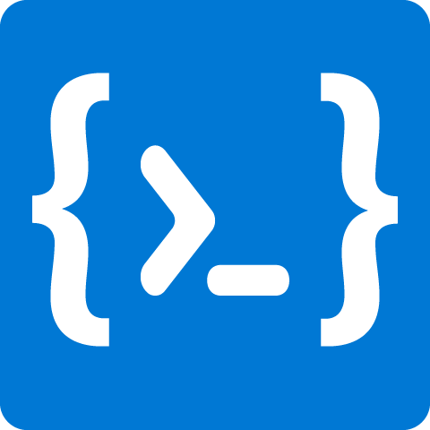

# SnipCommand

A free and open source command snippets manager for organize and copy fast.

<p align="center">
  
</p>

<p align="center">
  
  
</p>

<p align="center">
  
</p>

<p align="center">
    <strong>Built with Electron & React</strong> <br>
    Built for Windows, macOS and Linux
</p>


## Overview
<p align="center">
  
</p>

It helps you create, organize and store your commands (Excel formulas, Sql Queries, Terminal commands, etc.) with dynamic parameters for quick copy to it. Describe your commands with dynamic parameters also support documentation about your snippets. You can select or specify your dynamic values using with selectbox/inputbox for ready to paste the workspace. You can organize with tags.


## Features

### Core
- **ORGANIZE WITH TAGS & FAVOURITES** — Organize all commands with tags & favourites system.
- **DESCRIBE DYNAMIC PARAMETERS** — Describe dynamic parameters. Supporting input, selectbox and password generator for choosing parameter value.
- **DOCUMENTATION FOR COMMAND** — Describe documentation text for each command with Markdown Editor.
- **AUTOSAVE** — Automatically saves any changes you make during work.
- **SYNC** — Use any cloud synchronization service (iCloud Drive, Google Drive, Dropbox, etc.).
- **DATABASE** — Uses [LowDB](https://github.com/typicode/lowdb) to store your data locally.
- **LIGHT/DARK THEME** — Supporting 2 themes with consistent styling across all components.

### New in v0.2.x

- **GLOBAL HOTKEY + QUICK SEARCH PANEL** — Press `Alt+C` (customizable) from anywhere to open a floating search panel. Search, fill parameters, and copy — all without leaving your current app.
- **FUZZY SEARCH** — Smart multi-field weighted search across title, command, tags, and description. Typos and partial matches are handled gracefully.
- **#TAG PREFIX SEARCH** — Type `#docker` to filter by tag. Combine with search: `#docker restart` finds "restart" commands tagged with "docker".
- **USAGE FREQUENCY TRACKING** — Frequently used commands automatically rank higher in search results.
- **SYSTEM TRAY** — App runs in the background. Close the window and it stays in the tray, ready when you need it.
- **QUICK SAVE** — Save new command snippets directly from the Quick Search panel via the "+" button.
- **MULTI-MONITOR SUPPORT** — Quick Search panel appears on whichever screen your cursor is on.
- **CUSTOMIZABLE HOTKEY** — Configure your preferred global hotkey in Settings > General with a live key recorder.
- **AUTO-CLOSE AFTER COPY** — Optionally auto-close the search panel after copying a command (configurable in Settings > General).

### Improvements & Optimizations

- **API SINGLETON** — Database connection initialized once and reused, eliminating redundant disk reads on every operation.
- **REMOVED MOMENT.JS** — Replaced ~330 KB dependency with native Date API.
- **REMOVED LODASH** — Replaced ~531 KB dependency with native JS equivalents.
- **SECURITY HARDENED** — Removed Electron `remote` module, replaced with IPC handlers. Added HTML escaping to prevent XSS.
- **STABILITY** — Fixed multiple null-reference crashes, memory leaks, and added error handling to all file system operations.


## Contribution
Contribution are always **welcome and recommended!** Here is how:
- Fork the repository [(here is the guide).](https://help.github.com/articles/fork-a-repo/)
- Clone to your machine.

```
git clone https://github.com/YOUR_USERNAME/SnipCommand.git
```

- Install all development packages with `yarn install` command on root.
- Make your changes.
- Create a pull request.


### Build Setup

```bash
# install dependencies
yarn install

# serve with hot reload
yarn electron-dev

# build electron application for production
yarn release
```

## Releases

Visit the [this link](https://github.com/Tommylulu886943/SnipCommand/releases)


## Documentation

Visit the [this link](https://github.com/Tommylulu886943/SnipCommand/blob/master/documentation/DOCUMENTATION.md)

## Change Logs

You can check logs from [this link](https://github.com/Tommylulu886943/SnipCommand/blob/master/documentation/CHANGELOGS.md)


## Contributors

- **Güray Yarar** ([@gurayyarar](https://github.com/gurayyarar)) — Original author
- **Tommy Lu** (jkruby886743@gmail.com) — Bug fixes, new features, refactoring (v0.2.x)


## License

**SnipCommand** is an open source project that is licensed under the [MIT license](http://opensource.org/licenses/MIT).


## Donations

Donations are **greatly appreciated!**

**[BUY ME A COFFEE](http://bit.ly/2yEjtx5)**
